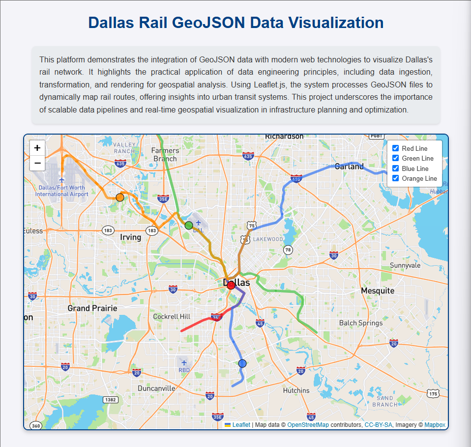

# Dallas Rail GeoJSON Visualization

This project demonstrates the integration of real-time data streaming, transformation, and visualization using modern data engineering techniques. The goal is to process Dallas rail network GeoJSON data, stream it using Apache Kafka, and visualize the results on a web platform powered by Flask and Leaflet.js.

---

## Technical Description

### **1. GeoJSON Data Preparation**

The raw GeoJSON data representing Dallas's rail network is processed using `create_geojson.py`. This script ensures that the data is clean and structured for further transformation. The output is a standardized GeoJSON file ready for downstream processing.

### **2. Data Transformation**

`transformation.py` converts the prepared GeoJSON data into a Kafka-compatible format. This script restructures the data into small, readable chunks that can be streamed through Kafka producers. The transformation process is optimized for scalability and compatibility.

### **3. Apache Kafka Integration**

Apache Kafka is employed for real-time data streaming. The system comprises:

-   **Producers**: Four separate scripts (`blue_line_prod.py`, `green_line_prod.py`, `orange_line_prod.py`, `red_line_prod.py`) stream GeoJSON data corresponding to different rail lines into a Kafka topic named `geodata_line`.
-   **Consumers**: The Flask application (`app.py`) acts as a Kafka consumer, processing incoming data and preparing it for visualization.

#### Kafka Setup:

-   **Zookeeper**: Provides coordination for Kafka.
-   **Bootstrap Server**: Handles broker communication.
-   **Topic Management**: A single Kafka topic (`geodata_line`) is created for streaming the data.

### **4. Flask Application**

The Flask web application serves as the backend for hosting the project. It consumes data from the Kafka topic, processes it, and feeds it to the frontend for rendering. The application also manages the real-time interaction between the data and the visualization.

### **5. Interactive Visualization**

The frontend uses Leaflet.js to create an interactive map displaying the rail network. The map dynamically updates as data is streamed from Kafka. The visualization provides insights into the structure and layout of Dallas's rail system, emphasizing real-time data representation.

---

## Execution Overview

1. **Data Preparation**: Prepare GeoJSON data using `create_geojson.py`.
2. **Transformation**: Process the data into Kafka-compatible format using `transformation.py`.
3. **Kafka Setup**:
    - Start Zookeeper: `zookeeper-server-start.bat ../../config/zookeeper.properties`
    - Start Bootstrap Server: `kafka-server-start.bat ../../config/server.properties`
    - Create Kafka Topic: `kafka-topics.bat --bootstrap-server 0.0.0.0:9092 --topic geodata_line --create --partitions 1 --replication-factor 1`
4. **Run Flask App**: Start `app.py` to initialize the consumer and host the website.
5. **Start Producers**: Begin streaming data with `blue_line_prod.py`, `green_line_prod.py`, `orange_line_prod.py`, and `red_line_prod.py`.

---

## Project Features

-   **Real-time Data Streaming**: Efficient handling of dynamic GeoJSON data streams using Kafka.
-   **Scalable Architecture**: Supports multi-line data processing and visualization with separate producers for each rail line.
-   **Interactive Visualization**: Web-based interface powered by Leaflet.js for exploring the rail network.
-   **Data Engineering Focus**: Demonstrates concepts like data preparation, transformation, and streaming in a practical scenario.

---
